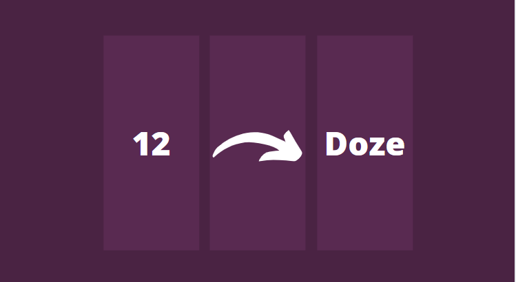
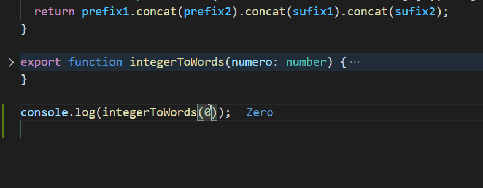

<div align="right">
  
  [](README.md)
    
</div>

<p align="center">
  
</p>

<p align="center">
  
  
     
  <a href="https://github.com/hernandesjunio">
    
  </a>  
    
</p>

<p align="center">
 <a href="#eye_speech_bubble-visualizar">Visualizar</a> •
 <a href="#information_source-sobre">Sobre</a> •
 <a href="#arrow_forward-executar">Executar</a> •
 <a href="#hammer_and_wrench-tecnologias">Tecnologias</a> • 
 <a href="#sparkles-funcionalidades">Funcionalidades</a> •
 <a href="#boy-autor">Autor</a> •
 <a href="#balance_scale-licença">Licença</a>
</p>

---

## :eye_speech_bubble: **Visualizar**

<div align="center">

| Pré Visualização  
| :------------------------------------------------------------------------------------:
| <kbd></kbd>

</div>
  
---

## :information_source: Sobre

<div align="center">

Algoritmo para conversão de números positivos inteiros para extenso.

---

</div>

## :arrow_forward: **Executar**

<div align="center">

Para executar esse projeto você precisa baixar este repositório, ter o Gerenciador de Pacotes do Node ([`NPM`](https://www.npmjs.com/get-npm)) ou o Gerenciador de Pacotes YARN ([`YARN`](https://yarnpkg.com/getting-started)) instalado.

Abra o prompt de comando no diretório do projeto, e execute os seguintes códigos:

<details>
  <summary><i>com <b>npm</b></i></summary>
  
```bash
# Instalar dependências
$ npm install ou npm i

# Executar os testes com Jest

$ npm test

````

</details>

<details>
<summary><i>com <b>yarn</b></i></summary>

```bash
# Instalar dependências
$ yarn install

# Executar os testes com Jest
$ npm test

````

</details>

> ⚠️ Será gerado arquivo HTML (test-report.html) com o resultado dos testes que pode ser aberto no navegador.

</div>

---

## :hammer_and_wrench: **Tecnologias**

<div align="center">

|                                      👨‍💻                                      |
| :--------------------------------------------------------------------------: |
|             [TypeScript 3.9.7](https://www.typescriptlang.org/)              |
|              [Jest](https://jestjs.io/docs/en/getting-started)               |
|               [Ts-Jest](https://www.npmjs.com/package/ts-jest)               |
|    [Jest-html-reporter](https://www.npmjs.com/package/jest-html-reporter)    |
|                        [Node](https://nodejs.org/en/)                        |
|                 [Husky](https://www.npmjs.com/package/husky)                 |
| [Git-Commit-Msg-Linter](https://www.npmjs.com/package/git-commit-msg-linter) |

</div>

---

## :sparkles: **Funcionalidades**

<div align="center">

|              :page_facing_up:              |
| :----------------------------------------: |
| Conversão de números inteiros para extenso |

</div>

---

## 🧑 **Autor**

<div align="center">

<a href="https://github.com/hernandesjunio">
 
 <br/>
 <sub><b>Hernandes Junio de Assis</b></sub>
</a>

Desenvolvido com por Hernandes 👋🏽 Meus Contatos!

[](https://www.linkedin.com/in/hernandesjunio/)
[](https://github.com/hernandesjunio)
[](mailto:hernandesjunio@gmail.com)

</div>

---

## :balance_scale: **Licença**

<div align="center">

Copyright © 2021 [Hernandes Junio](https://github.com/hernandesjunio).<br />
This project is licensed by [MIT](./LICENSE).

</div>
